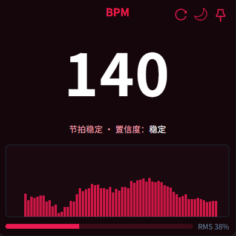
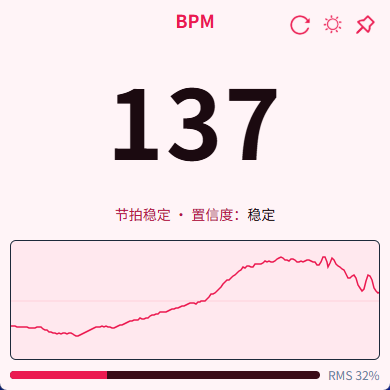

[](github.com/coderDJing/bpm-sniffer/releases/latest)
[](github.com/coderDJing/bpm-sniffer/releases)
[](github.com/coderDJing/bpm-sniffer/blob/main/LICENSE)
[](github.com/coderDJing/bpm-sniffer/commits/master)
[](github.com/coderDJing/bpm-sniffer/commits/master)

## BPM Sniffer

<p align="center">
  <a href="/README.md">English</a>
    ·
  <a href="/readme/README_CN.md">简体中文</a>
 </p>

Lightweight local real-time BPM (beats per minute) detector.
Play music in any player or web page, and it will automatically display the current song's BPM in real time.
No virtual sound card required — works out of the box.

Supports bilingual UI (Simplified Chinese / English). The language follows your system locale.

> Windows only (Win10 and above, x64). macOS is not planned due to system-level limitations.

<p align="center">
  
  
</p>

### What is this

- Automatically detects and displays the BPM from audio currently playing on your system.
- Compact floating window with always-on-top, light/dark themes, and simple visualizations.
- Entirely local processing. No audio is collected or uploaded.

### Key Features

- **Ready to use**: No extra drivers or virtual sound card needed.
- **Stable readings**: Stabilization and anti-jitter for track changes and weak beats.
- **Visualizations**: Click on the waveform panel to switch among Waveform / Bar / Spectrogram.
- **Pin & theme**: Use the pushpin to toggle always-on-top; switch between light and dark themes.
- **Auto updates (optional)**: Only stable builds (tags like `v1.2.3`) receive OTA updates; pre-release builds must be updated manually.
- **Bilingual UI**: Follows system language (Simplified Chinese / English).

### Download & Install

- Go to the latest release page and download the Windows installer (NSIS): [Releases · coderDJing/bpm-sniffer](https://github.com/coderDJing/bpm-sniffer/releases/latest).


### How to Use

1. Play your music (any player works).
2. Open BPM Sniffer. The BPM will automatically follow the current track.
3. Common actions:
   - Pushpin (top-right): Toggle always-on-top.
   - Sun/Moon (top-right): Switch light/dark theme.
   - Click waveform: Switch visualization mode (Waveform / Bar / Spectrogram).
   - Refresh (top-right): Reset quickly to re-lock onto a new beat.

### FAQ

- Not seeing values / always 0? Make sure your system is playing audio, the player volume is not muted, or click Refresh (top-right) and try again.
- Why does the number wiggle slightly sometimes? This is normal during track changes or transitions; it will stabilize shortly.
- Does it require microphone permission? No. The app reads the system loopback audio and does not use the microphone.
- Can I switch the UI language? It currently follows the system language (Simplified Chinese / English).

### Platform & Privacy

- Windows only (Win10 and above, x64). macOS is not planned due to system limitations.
- All processing is local. No audio data is uploaded.

---

### For Developers

Development & Debugging:

```bash
pnpm install
pnpm dev
```

Build:

```bash
pnpm build
```

- Installer output: `src-tauri/target/release/bundle/nsis/`
- Tagging rules:
  - Push `vX.Y.Z` to trigger a stable release (with OTA updates).
  - Push `vX.Y.Z-suffix` (must contain `-`, e.g. `-rc1`) to trigger a pre-release build (manual install only).

Algorithms & Implementation: see [Algorithm principles & flow](doc/算法原理与流程.md).

License: MIT (see `LICENSE`).