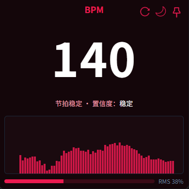
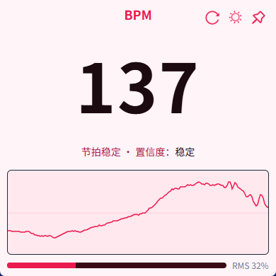

[](github.com/coderDJing/bpm-sniffer/releases/latest)
[](github.com/coderDJing/bpm-sniffer/releases)
[](github.com/coderDJing/bpm-sniffer/blob/main/LICENSE)
[](github.com/coderDJing/bpm-sniffer/commits/master)
[](github.com/coderDJing/bpm-sniffer/commits/master)

## BPM Sniffer

<p align="center">
  <a href="/README.md">English</a>
    ·
  <a href="/readme/README_CN.md">简体中文</a>
 </p>

轻量本地节拍（BPM）实时探测器。
打开任意播放器或网页播放音乐，即可自动实时显示当前歌曲的 BPM；
无需虚拟声卡，开箱即用。

支持中英文界面（简体中文 / English），自动跟随系统语言。

> 仅支持 Windows（Win10 及以上，x64），macOS 由于系统底层限制不计划支持。

<p align="center">
  
  
</p>

### 这是什么

- 从系统正在播放的音频中，自动检测并显示 BPM。
- 小巧悬浮窗，支持窗口置顶、深浅色主题与简易可视化。
- 全程本地处理，不采集也不上传任何音频。

### 主要功能

- **即开即用**：无需额外驱动/虚拟声卡。
- **更稳的数字**：针对切歌与弱节奏做了稳定化与抗抖动处理。
- **可视化**：点击波形面板可在「波形/柱状/瀑布」三种模式间切换。
- **置顶与主题**：右上角图钉可置顶窗口；可切换明/暗主题。
- **自动更新（可选）**：有新版本会静默下载，重启后生效。
- **中英文界面**：自动跟随系统语言（简体中文 / English）。

### 下载与安装

- 前往发布页的 latest 下载 Windows 安装包（NSIS）：[Releases · coderDJing/bpm-sniffer](https://github.com/coderDJing/bpm-sniffer/releases/latest)。

### 如何使用

1. 播放你喜欢的音乐（任何播放器均可）。
2. 打开 BPM Sniffer，数字会自动跟随当前曲目。
3. 常用操作：
   - 右上角图钉：窗口置顶/取消置顶。
   - 右上角太阳/月亮：切换明/暗主题。
   - 点击波形：切换可视化模式（波形/柱状/瀑布）。
   - 右上角刷新：一键重置，快速重新锁定新节拍。

### 常见问题

- 看不到数值/总是 0？请确认系统正在播放声音、播放器音量不为 0，或点击右上角刷新后再试。
- 为什么数字偶尔会小幅跳动？在切歌或过渡段属于正常现象，应用会很快稳定。
- 需要麦克风权限吗？不需要。应用读取系统回环音频，不使用麦克风。
 - 能切换界面语言吗？当前自动跟随系统语言（简体中文 / English）。

### 平台与隐私

- 仅支持 Windows（Win10 及以上，x64），macOS 由于系统限制不计划支持。
- 所有处理在本地完成，不上传音频数据。

---

### 给开发者

开发与调试：

```bash
pnpm install
pnpm dev
```

打包：

```bash
pnpm build
```

- 安装包输出：`src-tauri/target/release/bundle/nsis/`

算法与实现：详见 [算法原理与流程](../doc/算法原理与流程.md)。

许可证：MIT（见 `LICENSE`）。


